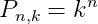
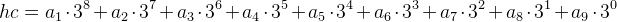
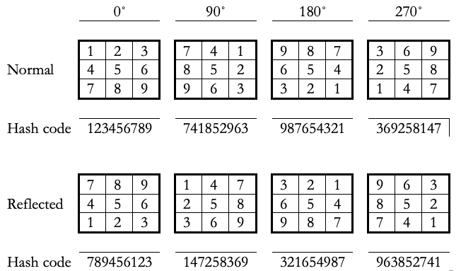

# Noughts & Crosses

## Introduction

Java implementation of a reinforcement learning agent that plays noughts and crosses (tic-tac-toe).

Copyright (c) 2003-2019 Jose Hernandez

Some portions of the referee code are based on code originally developed by Jim Farrand.

Our application has been designed to allow for the easy addition of new types of players, including players with Q-Learning algorithms with different action strategies.  The following players are currently available:

| Player Name | Description |
|:------------|:------------|
| FixedPlayer | A deterministic player that chooses the first available position on the board start from the top-left |
| RandomPlayer | A non-deterministic player that chooses random positions on the board |
| QLearningPlayer | Q-Learning player that learns only from its own moves |
| ObservingPlayer | Q-Learning player that learns from its own as well as the opponent’s moves |
| SymmetricPlayer | Q-Learning player that takes board / state symmetries into account |
| ObservingSymmetricPlayer | Q-Learning player that takes symmetries into account and learns from the opponent's moves |

## Board state, action and reward storage

The Q-Learning player implementations use a two-dimensional matrix to store the board
state-action-reward relationship.
State-action pairs are used as indices into specific locations in the matrix where the reward will
be stored thus establishing the state-action-reward relationship.

A 3x3 noughts and crosses (tic-tac-toe) board has 362880 (9! - nine factorial) possible board states
and 9 actions. The number of board states number is given by the number of ways in which 9 different
elements can be presented. In actual practice the amount of board states is much lower than this
because the number given above does not take into account that permutations of elements of the same
type result in the same board positions. In other words, if we have pieces *X1* and *X2* occupying
positions 1 and 2 in the board respectively, swapping *X1* and *X2* such that they now occupy
positions 2 and 1 results in the exact same board state.  Furthermore, since valid board state
cannot have more than 5 *X's* or *O's* pieces, there are a number of board states which are
unreachable and further limit the total number of possible board states.

From combinatorial mathematics we know that the number of [k permutations with repetition of n](https://en.wikipedia.org/wiki/Permutation#Permutations_with_repetition) elements, in other words, arrangements of a fixed length k of elements taken from a given set of size n,
is given by the following equation:

Therefore, grouping the two different game pieces and the empty sapce in sets of 9, results in 19683 board states.

Note that we can still significantly reduce the size of the matrix required by removing board states
that amount to piece swaps as described above but this complicates data manipulation unnecessarily
so we will settle for a board size of 19683 states by 9 actions.

In order to allow storage of rewards relative to board position and actions, the software design
incorporates a hash function which to allow us to index the state-action table.  Given that we can
think of the tic-tac-toe board as being a set of 9 boxes any of which can carry one of three
elements, we can think of a hash function as being a base three converted for a nine digit number.
This hash function based on a simple eight degree polynomial which translates base-3 board
states into base-10 indices:

## The Q-Learning algorithm

The Q-Learning algorithm has been implemented using the non-deterministic equation given in [Mitchell
(1997)](#1--Tom-M--Mitchell--1997).

The simplest learning player implemented here looks only at its own reward to update Q. For the
purpose of this exercise we can take s’ and a’ to be the state and action values before or after the
opponent moves. For simplicity we have chosen a two stage update method where the player stores both
its own and the opponent’s move but only considers its own rewards.  This ensures continuity in the
updates and allows Q values to be propagated back more effectively.

To ensure that the players spend some time exploring the board, we are incrementing *k* over a
number of moves after which start favouring exploitation of the learnt policy. The values used
here are *0.7* for *gamma* and *0.001* for *k’s* initial value. This value is then increment by
*0.001* up to a limit of *100* every time Q is updated.

Using the same *k* and *gamma* values with *k* being incremented over time to favour exploitation,
the player that took *s’* and *a’* to be the result of only its own moves performed worst than
the one that took *s’* and ‘a after the opponent moved using the two stage update process described
above. Performance increased significantly when the player also begins learning from the opponent’s
move.å

### Learning from the opponent

A second and more intelligent version of the player described above also makes use of the opponent’s
moves and reward by updating Q with an inverted board state.  Inverted board state in this case
refers to swapping all *X* for *O* and vice-versa.

Again, using the same *k*, *gamma* and *k-increment* values, the player that learns from its
opponent’s moves takes some eight thousand moves before the agent stopped showing any improvement.
Similar results can be obtained using the simpler player. Because the value of *k* increased at
the same rate in all players, the back propagation process used in the Q-Learning algorithm favours
those players that fill up the board quickest.

### Playing against a fixed player

A test league was run using a player with a fixed strategy which consisted of picking the next
available slot in the board from left to right and top to bottom.  Unsurprisingly all players were
able to learn the target policy very quickly and consistently win every single game. It is however
worth noting that setting an initial value for *k* that is too high (i.e. *0.1*) can result in
performance degradation because the learning player would be trying to exploit the policy before it
has fully learned it.

## Leveraging symmetries

There are a number of board positions in the game of tic-tac-toe which can be thought of as being equivalent.
These equivalent board positions correspond to rotation and reflections of the board as shown in the following figure:

The hash function used to select a state-action index can be modified to consistently pick one of
the symmetries and hence reduce the number of possibly redundant board states. To achieve this, the
program considers the board state supplied by the referee as a normal (non-reflected) board state
with no rotation; it then applies every one of the eight translations calculating the hash code at
the same time and finally chooses the board state with the highest hash code as the state representing all symmetries.

Implementation and subsequent test of this feature suggest that Q can be initially learned much
quicker but performance begins to degrade over a period of time in favour of the simpler
non-symmetric algorithm. This is due to the fact that reducing the number of board states by a
factor of eight leads to an over-simplification of state-action table.

## Notes

The equations presented in this article have been rendered using [CodeCogs](https://latex.codecogs.com/eqneditor/editor.php).

## References

1. Wikipedia contributors. (2019, August 10). Permutation. In Wikipedia, The Free Encyclopedia. Retrieved 18:39, August 11, 2019, from [https://en.wikipedia.org/w/index.php?title=Permutation&oldid=910242548](https://en.wikipedia.org/w/index.php?title=Permutation&oldid=910242548).
1. Tom M. Mitchell (1997). [Machine Learning](http://www.cs.cmu.edu/~tom/mlbook.html). McGraw-Hill series in computer science. ISBN 0-07-115467-1
1. Daniel Dante Garcia (1990). [GAMESMAN: a finite, two-person, perfect-information game generator](https://people.eecs.berkeley.edu/~ddgarcia/software/gamesman/GAMESMAN.pdf). University of California at Berkeley.
